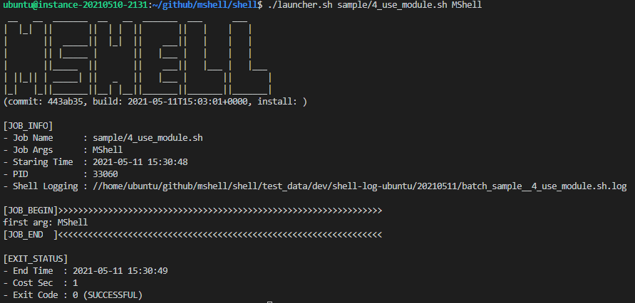

# MShell
> MShell is to modularize your shell scripts.


MShell stands for Modularized Shell. It helps you to write large yet well-maintainable shell scripts.



## Installation

MacOS & Linux:

```sh
git clone https://github.com/maoshuai/mshell.git
echo 'MSHELL_PROFILE=dev' > ~/.mshellrc
```


## Usage example

```sh
shell/launcher.sh sample/1_native_shell.sh
```

## Build


```sh
mvn clean package
```

## Release History

* 0.0.1
    * CHANGE: First release


## Meta

Maoshuai – [GitHub](https://github.com/maoshuai) – imshuai67@gmail.com

Distributed under the Apache License 2.0 . See ``LICENSE`` for more information.


## Contributing

1. Fork it (<https://github.com/maoshuai/mshell/fork>)
2. Create your feature branch (`git checkout -b feature/fooBar`)
3. Commit your changes (`git commit -am 'Add some fooBar'`)
4. Push to the branch (`git push origin feature/fooBar`)
5. Create a new Pull Request


