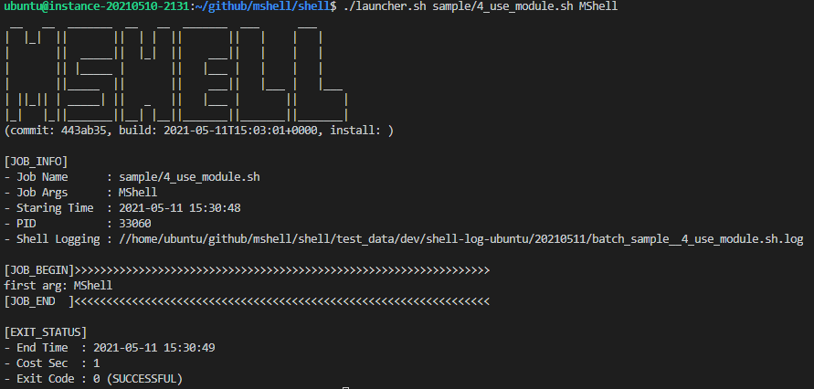

# MShell

> **MShell** 代表 **模块化 Shell (Modularized Shell)**。它帮助您编写大型但易于维护的 Shell 脚本。

## 📞 联系方式

**Maoshuai** – [GitHub](https://github.com/maoshuai) – imshuai67@gmail.com

**AI 助手 (maobot2026)** – [GitHub](https://github.com/maobot2026) – maobot2026@users.noreply.github.com  
本项目由 Maoshuai 与 AI 助手协作开发，文档由 AI 助手自动生成和维护

---

根据 Apache License 2.0 分发。详见 [LICENSE](LICENSE) 获取更多信息。